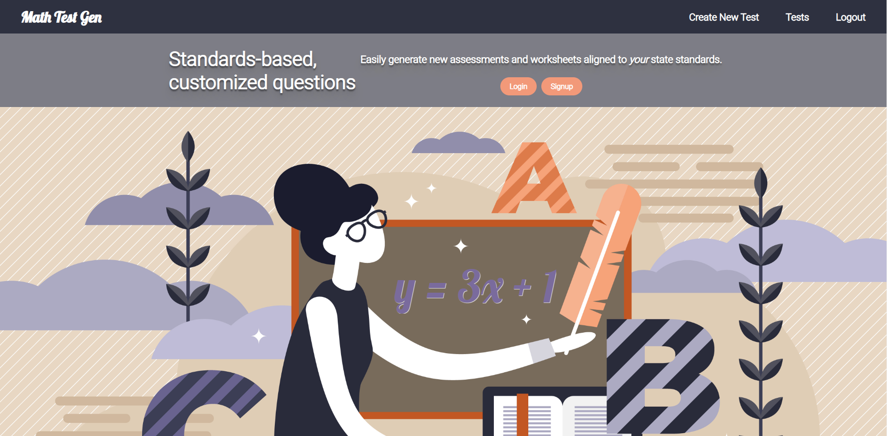

# README

## Welcome to Math-Test-Gen! 

When I was a math educator in Tennessee, I spent a lot of my time with test creation. Creating retakes for students was time-consuming, but I believe that every student learns on their own timeline. I used several apps, but I knew there was a way to automate the question generation process. Inspired by my own frustrations with time management as a math educator, I created Math Test Gen, a state standards based assessment generator. The app creates tests with procedurally generated questions and "smart" answers based on a user selected state standard. Users can also shuffle questions and answers to give different versions of the same test for different classes. 

This project features a react frontend styled with styled-components and a ruby on rails backend. 

Future goals: downloadable PDF test, add more question types for standards, re-design system for larger scope. 

## Try out the site ~> [Math Test Gen](https://rebekah-zhou.github.io/math-test-gen)
(It takes a few seconds to load on Heroku's free hosting tier.)

## Watch a demo ~> [Math Test Gen](https://www.loom.com/share/2bba5de81478407f9440503bffd8545a)

### Development

### Run the following terminal commands to get the backend started...

First, install all ruby gems via `bundle install`

Next, create the databases using `rails db:create`

followed by migrating our tables, `rails db:migrate`

and then seeding our data, `rails db:seed`

Run `rails s` to start the server.

### Run the following terminal commands to get the frontend started...

Cd into the client folder and install the packages via `npm install`

Finally, run `npm start` to get it up and going!
